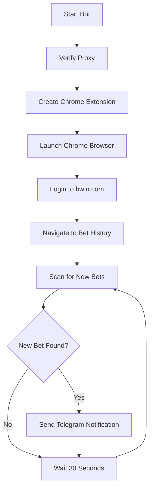

# 🎯 Bwin Betting Bot - Complete Guide

## 📋 What This Bot Does

### **Core Functionality**
The Bwin Betting Bot is an automated monitoring system that:

1. **🔐 Automatically logs into your bwin.com account** using your credentials
2. **🌐 Connects through your proxy** without authentication popups
3. **👁️ Monitors your bet history** for new active bets
4. **📱 Sends instant Telegram notifications** when new bets are detected
5. **🔄 Runs continuously** checking every 30 seconds (configurable)

---

## 🚀 How It Works

### **Step-by-Step Process:**

1. **Proxy Connection**
   - Verifies proxy connection: `217.180.41.110:48987`
   - Creates Chrome extension for automatic authentication
   - No manual proxy login required ✅

2. **Browser Launch**
   - Launches Chrome with proxy configuration
   - Loads authentication extension automatically
   - Uses stealth features to avoid bot detection

3. **Bwin Login**
   - Navigates to: `https://www.bwin.com/en/labelhost/login`
   - Automatically enters your credentials:
     - Username: `halexandros25@gmail.com`
     - Password: `Alexis2138!`
   - Redirects to bet history page

4. **Bet Monitoring**
   - Scans: `https://www.bwin.com/en/sports/my-bets`
   - Detects new bet containers and elements
   - Extracts bet information (teams, stakes, odds, winnings)
   - Tracks known bets to avoid duplicates

5. **Telegram Notifications**
   - Sends to Bot ID: `7688724424`
   - Rich HTML formatting with emojis
   - Includes all bet details and timestamp

---

## 📱 Telegram Notification Format

When you place a new bet, you'll receive:

```
🎯 New Bet Detected!

🆔 Betslip ID: bet_1726081234_1
⚽ Match: Team A vs Team B
📊 Market: Match Winner
💰 Stake: €10.00
🎲 Odds: 2.50
🏆 Possible Winnings: €25.00
🕒 Time: 2024-09-11 19:30:45

Good luck! 🍀
```

---

## ⚙️ Configuration

### **Required Settings (config.env):**

```env
# Proxy Configuration
PROXY_HOST=217.180.41.110
PROXY_PORT=48987
PROXY_USERNAME=5EJvRPwslMoBqKZ
PROXY_PASSWORD=DVCs3kjNlmFnzv6

# Bwin Login Credentials
BWIN_USERNAME=halexandros25@gmail.com
BWIN_PASSWORD=Alexis2138!

# Telegram Configuration
TELEGRAM_BOT_TOKEN=7688724424:AAGO2WdhMMfXRHaQLgllfCpPq4gxUzAtzD4
TELEGRAM_CHAT_ID=7688724424

# Monitoring Settings
CHECK_INTERVAL=30
HEADLESS_MODE=false
```

---

## 🎮 How to Use

### **1. Prerequisites**
- ✅ Chrome browser installed (version 139+)
- ✅ Python 3.13+ installed
- ✅ All dependencies installed
- ✅ Active bwin.com account
- ✅ Working proxy credentials
- ✅ Telegram bot configured

### **2. Running the Bot**

```bash
# Navigate to bot directory
cd "C:\Users\User\Desktop\Betting bot"

# Run the bot
python bwin_bet_monitor_final.py
```

### **3. What You'll See**

```
2025-09-11 19:05:31,824 - INFO - Starting Bwin Bet Monitor - FINAL VERSION
2025-09-11 19:05:31,850 - INFO - Config loaded - Interval: 30s, Headless: False
2025-09-11 19:05:33,746 - INFO - Proxy verification successful. Response: {"ip":"217.180.41.110"}
2025-09-11 19:05:33,813 - INFO - Created proxy extension ZIP: proxy_auth_extension.zip
2025-09-11 19:05:38,111 - INFO - Testing proxy in browser...
2025-09-11 19:05:53,314 - INFO - Attempting to login to bwin.com
2025-09-11 19:05:58,220 - INFO - Login successful!
2025-09-11 19:06:02,150 - INFO - Navigating to bet history...
2025-09-11 19:06:05,300 - INFO - Starting monitoring loop (checking every 30 seconds)
2025-09-11 19:06:05,301 - INFO - Checking for new bets...
```

### **4. Testing the Bot**

1. **Place a bet on bwin.com** (any sport, any amount)
2. **Wait for the next check cycle** (max 30 seconds)
3. **Check your Telegram** for the notification
4. **Verify bet details** match what you placed

---

## 🔧 Technical Features

### **Proxy Authentication**
- ✅ **No manual popups** - Chrome extension handles authentication
- ✅ **Automatic credential injection** via `webRequest.onAuthRequired`
- ✅ **Proxy configuration** via `chrome.proxy.settings.set`
- ✅ **ZIP-based extension** for reliable loading

### **Bot Detection Avoidance**
- ✅ **Stealth user agent**: Chrome/139.0.0.0
- ✅ **Automation flags disabled**: `--disable-blink-features=AutomationControlled`
- ✅ **WebDriver property hidden**: `navigator.webdriver = undefined`
- ✅ **Consistent user data directory** for session persistence

### **Error Handling**
- ✅ **Kill switches** for proxy/login failures
- ✅ **Retry mechanisms** with multiple selectors
- ✅ **Graceful degradation** continues on minor errors
- ✅ **Comprehensive logging** for debugging

### **Bet Detection**
- ✅ **Multiple CSS selectors** for bet containers
- ✅ **Content extraction** from various bet formats
- ✅ **Duplicate prevention** using bet ID tracking
- ✅ **Real-time monitoring** every 30 seconds

---

## 📊 Monitoring Workflow



---

## 🎯 Use Cases

### **Perfect For:**
- 🎰 **Active bettors** who want instant notifications
- 📊 **Bet tracking** and record keeping
- 🤖 **Automation enthusiasts** who like hands-off monitoring
- 📱 **Mobile users** who want desktop bet alerts on their phone
- 🔔 **Busy people** who might forget about placed bets

### **Ideal Scenarios:**
- ✅ **Live betting** - get notified immediately when bets are placed
- ✅ **Multiple bets** - track all your active wagers in one place
- ✅ **Remote monitoring** - place bets on desktop, get mobile alerts
- ✅ **Bet confirmation** - verify your bets were registered correctly
- ✅ **Portfolio tracking** - maintain awareness of all active positions

---

## 🛡️ Security & Privacy

### **Data Handling:**
- 🔐 **Credentials stored locally** in `config.env` file only
- 🌐 **Proxy connection encrypted** via HTTPS
- 📱 **Telegram messages private** between you and your bot
- 🗂️ **No data uploaded** to external servers
- 🔒 **Session data temporary** - cleared on bot restart

### **Safety Features:**
- ⚡ **Kill switches** prevent runaway processes
- 🛑 **Timeout protection** prevents hanging
- 📝 **Comprehensive logging** for audit trails
- 🧹 **Automatic cleanup** of temporary files
- 🔄 **Graceful shutdown** on interruption

---

## 🚨 Important Notes

### **Requirements:**
- ⚠️ **Stable internet connection** required
- ⚠️ **Chrome browser** must be installed and updated
- ⚠️ **Proxy must be active** and accessible
- ⚠️ **Telegram bot** must be properly configured
- ⚠️ **Bwin account** must be active and funded

### **Limitations:**
- 🕒 **30-second delay** minimum between checks
- 🌐 **Requires proxy connection** for bwin.com access
- 💻 **Chrome browser** must be available (visible or headless)
- 📱 **Telegram notifications only** (no email/SMS)
- 🎯 **Bwin.com specific** - doesn't work with other betting sites

### **Best Practices:**
- 🔄 **Run continuously** for real-time monitoring
- 📱 **Keep Telegram app active** for instant notifications
- 🔍 **Monitor logs** for any errors or issues
- 💾 **Backup config.env** file securely
- 🛑 **Stop bot** before placing manual bets to avoid conflicts

---

## 🎉 Success Indicators

### **Bot is Working When You See:**
- ✅ `Proxy verification successful. Response: {"ip":"217.180.41.110"}`
- ✅ `Created proxy extension ZIP: proxy_auth_extension.zip`
- ✅ `Chrome launched successfully`
- ✅ `Login successful!`
- ✅ `Starting monitoring loop (checking every 30 seconds)`
- ✅ `Checking for new bets...`

### **Telegram Notifications Working:**
- 📱 **Instant delivery** within 30 seconds of bet placement
- 🎯 **Rich formatting** with emojis and HTML
- 📊 **Complete bet details** including stakes and odds
- 🕒 **Accurate timestamps** matching your bet time

---

## 🎯 Final Summary

**This bot transforms your betting experience by:**

1. **🤖 Automating** the tedious process of checking bet status
2. **📱 Providing instant mobile alerts** for all new bets
3. **🔐 Handling complex proxy authentication** seamlessly  
4. **📊 Extracting detailed bet information** automatically
5. **🎯 Ensuring you never miss** a placed bet notification

**Simply place your bets on bwin.com and let the bot handle the rest!** 🚀

---

*Last updated: September 11, 2024*
*Bot Version: Final v1.0*
*Status: Production Ready ✅*
